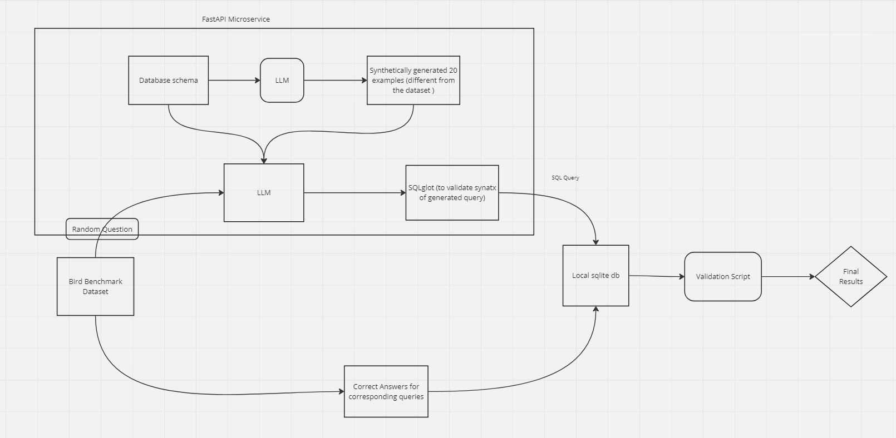
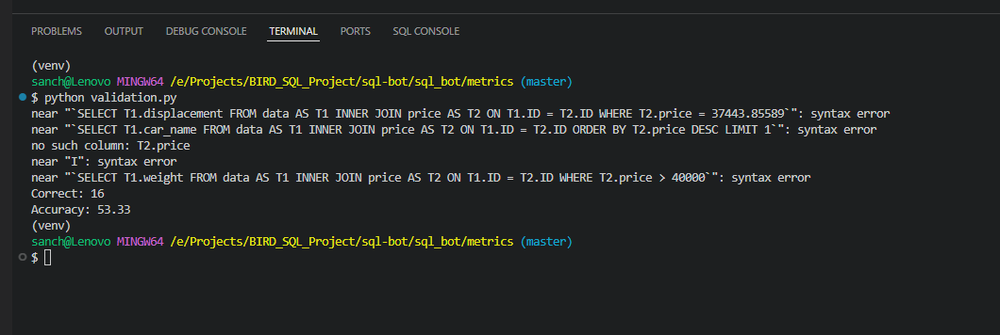

Okay, here's a comprehensive README based on the provided information:

# Text-to-SQL Engine with Bird Benchmark Evaluation

This project implements a Python-based text-to-SQL engine that leverages a Large Language Model (LLM) to translate natural language questions into SQL queries. It includes validation of the generated SQL syntax using the `sqlglot` library and evaluates the engine's performance using the Bird benchmark dataset.

## Architecture

The project is designed with a microservices architecture, organized into four main folders:

* **`lib`:**
    * `bot.py`: Core logic for the text-to-SQL engine.
    * `llm_models.py`: Defines the specific LLM to be utilized.
    * `llm_schema.txt`: Stores the schema of the local database used for validation.
    * `output_modifier.py`: Validates the generated SQL queries using `sqlglot`.
    * `schema_generator.py`: Generates schema definitions for Bird benchmark datasets.

* **`routes`:**
    * `llm_bot.py`: Defines API endpoints for interacting with the text-to-SQL engine.
    * `validate_token.py`: Implements authentication to protect API access.

* **`vector_db`:**
    * `vector_db_models.py`: Specifies the model for generating vector embeddings.
    * `vector_embeddings.py`: Creates vector embeddings for sample data (distinct from the Bird benchmark).

* **`metrics`:**
    * `const.py`: Stores file paths for the local SQL database used in validation.
    * `validation.py`: Evaluates the LLM-generated SQL queries against correct queries from the Bird benchmark.
    * `db_id.json`: Contains questions and corresponding correct SQL queries for validation.
    * `output_results.json`: Stores the final results of the validation process.

## Features

* **Text-to-SQL Conversion:** Translates natural language questions into executable SQL queries using an LLM.
* **SQL Syntax Validation:** Ensures the generated SQL queries are syntactically correct using `sqlglot`.
* **Bird Benchmark Evaluation:**  Compares LLM-generated queries against the Bird benchmark to assess accuracy.
* **Local Database Validation:** Executes queries on a local database (SQLite, DuckDB, PostgreSQL, etc.) to further verify results.
* **Microservices Architecture:** Promotes modularity, scalability, and maintainability.
* **API Endpoints:** Provides a structured interface for interacting with the engine.
* **Authentication:** Secures API access with token validation.
* **Vector Embeddings:** Supports the creation of vector embeddings for RAG queries.

## Setup and Usage

1. **Clone the repository:** 
   ```bash
   git clone <repository_url>
   ```

2. **Install dependencies:**
   ```bash
   pip install -r requirements.txt
   ```

3. **Configure:**
   * Update `const.py` with the appropriate file paths for your local database and other configuration settings.
   * Choose your desired LLM in `llm_models.py`.
   * Generate the schema for your chosen Bird benchmark dataset using `schema_generator.py`.
   * Generate the embeddings for sample data which is different from the Bird benchmark dataset using `vector_embeddings.py`.

4. **Run the application:**
   ```bash
   # Start the API server 
   export CHROMA_DB_PATH=<your_vector_db_path>  #optional
   export GEMINI_API_KEY=<your_gemini_api_key>  
   export LLM_SCHEMA_PATH=<your_schema_path>  #optional
   export SERVICE_COM_TOKEN=<your_service_com_token>  #optional

   uvicorn sql_bot.main:api --reload --host 0.0.0.0 --port 8000
   ```

5. **Perform validation:**
   ```bash
   # Run the validation script
   python metrics/validation.py
   ```

## Contributing

Contributions are welcome! Please follow these guidelines:

* Fork the repository.
* Create a new branch for your feature or bug fix.
* Make your changes and commit them with clear, descriptive messages.
* Push your changes to your fork.
* Submit a pull request to the main repository.

## License

This project is licensed under the [MIT License](LICENSE).



I have achieved an accuracy of 53.33% 

